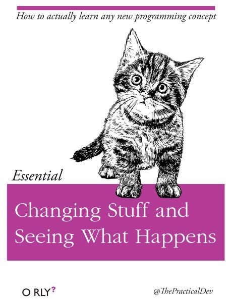

```{r setup, include=FALSE}
knitr::opts_chunk$set(echo = TRUE, 
                      warning = FALSE, 
                      message = FALSE,
                      fig.align = TRUE,
                      fig.width = 7,
                      fig.height = 7
                      )


library(tidyverse) # loads packages for data manipulation (dplyr/tidyr)
```

## Resources

* [Reproducible workflows](https://psyteachr.github.io/msc-data-skills/repro.html) in Data Skills for Reproducible Science
* [R Markdown Cheatsheet](https://github.com/rstudio/cheatsheets/raw/master/rmarkdown-2.0.pdf)
* [Stub script for this lesson](stubs/6_repro.Rmd)


## My Favourite R Functions

1. ggplot()
    - geom_violin()
    - geom_boxplot()
1. mutate()
1. gather()


## Images


```{r, echo = FALSE, fig.align='right'}

```


## Tables

```{r}
disgust <- read_csv("data/disgust.csv") %>%
  gather(question, score, moral1:pathogen7) %>%
  separate(question, into = c("domain", "n"), sep = -1) %>%
  group_by(user_id, domain) %>%
  summarise(score = mean(score)) %>%
  ungroup() %>%
  group_by(domain) %>%
  summarise(mean = mean(score, na.rm = TRUE),
            sd = sd(score, na.rm = TRUE)) %>%
  mutate_if(is.numeric, round, 2)


knitr::kable(disgust, digits = 3)
```


## Inline Code

```{r}
moral_mean <- disgust %>% filter(domain == "moral") %>% pull(mean)
sexual_mean <- disgust %>% filter(domain == "sexual") %>% pull(mean)
pathogen_mean <- disgust %>% filter(domain == "pathogen") %>% pull(mean)
```


The mean score for moral disgust was `r moral_mean`, the mean score for sexual disgust was `r sexual_mean`, and the mean score for pathogen disgust was `r pathogen_mean`.

## Citations

We used Tidyverse [@tidyverse].

Other citation style [-@tidyverse].

## Source .R Files


```{r}
source("iris.R")
```


## References

